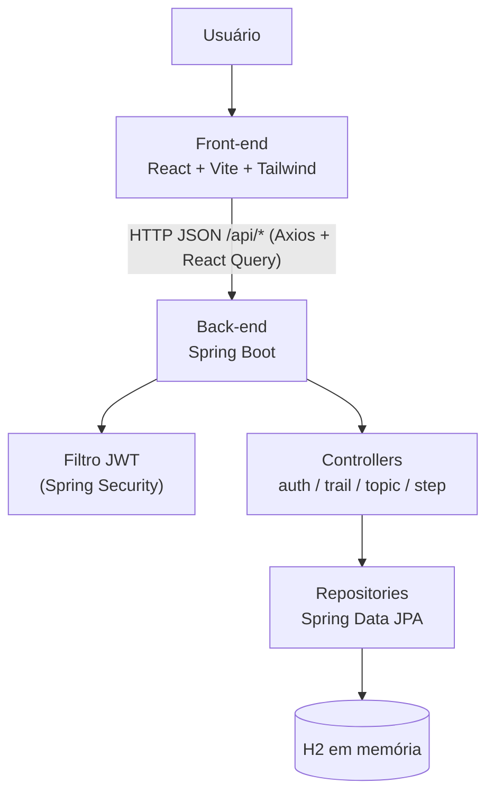

# Bitmap: Plataforma Web Gamificada para Apoio ao Estudo de Matemática Discreta

**Título do TCC:** Bitmap: Plataforma Web Gamificada para Apoio ao Estudo de Matemática Discreta
**Alunos:** Ana Luiza Seabra Ventapane Soares, Daniel Pedro de Paula, Vinícius Alves Sigolo David
**Semestre de Defesa:** 2026-1

[PDF do TCC](escrita_tcc/2026_TCC_Ana_Daniel_Vinicius_Final.pdf)

# TL;DR

Pré-requisitos: Java 21 e Node.js.

```
cd back
set JAVA_HOME=<caminho do seu JDK 21>
mvnw.cmd spring-boot:run
```

```
cd front
npm install
npm run dev
```

Abra `http://localhost:5173` e entre com `aluno@exemplo.com` / `senha123`.

# Descrição Geral

Plataforma web gamificada de apoio ao aprendizado autônomo de estudantes de
Computação, com foco inicial em Matemática Discreta. O conteúdo é organizado
em uma trilha de aprendizagem estruturada em tópicos (teóricos, práticos e de
revisão), cada um com exercícios corrigidos pelo servidor, permitindo ao
estudante estudar de forma independente e acompanhar seu próprio progresso.

# Funcionalidades

* Autenticação
   * Cadastro de novo usuário
   * Login com e-mail e senha (token JWT)
* Trilha de aprendizagem (Hub)
   * Lista de tópicos da trilha "Teoria dos Conjuntos"
   * Indicação visual de tópicos já concluídos
* Conteúdo e exercícios
   * Conteúdo teórico de cada tópico
   * Exercícios de múltipla escolha com correção no servidor
   * Feedback imediato (certo/errado + resposta correta)
* Progresso
   * Percentual de conclusão da trilha, calculado a partir dos tópicos concluídos
   * Exibido no Dashboard e no Hub

# Arquitetura



- `back/` — API em Spring Boot + H2 em memória (sem banco externo), popula o
  próprio banco ao iniciar
- `front/` — SPA em React + Vite + Tailwind CSS, consumindo a API via Axios e
  TanStack React Query, com estado de autenticação em Redux
- `escrita_tcc/` — PDF do TCC

# Dependências

* [Java 21](https://adoptium.net/)
* [Node.js](https://nodejs.org/)
* [Maven](https://maven.apache.org/) — não precisa instalar, o projeto já traz o wrapper (`mvnw.cmd`)
* Banco de dados: nenhum a instalar — usa H2 em memória, populado automaticamente

# Execução

### Backend (Windows)

Descubra onde o Java está instalado no seu PC — abra o cmd e rode:

```
where java
```

Vai aparecer um caminho tipo `C:\Programas\Java\jdk-21\bin\java.exe`. Copie
esse caminho e tire o `\bin\java.exe` do final — isso é o seu `JAVA_HOME`.

Depois, no terminal:

```
cd back
set JAVA_HOME=C:\Programas\Java\jdk-21
mvnw.cmd spring-boot:run
```

(troque o caminho do `JAVA_HOME` pelo que você achou no `where java`)

Sobe em `http://localhost:8080`. O banco H2 é populado automaticamente ao
iniciar (`DataSeeder`) com a trilha "Teoria dos Conjuntos" e um usuário de
demonstração:

- E-mail: `aluno@exemplo.com`
- Senha: `senha123`

Console do H2 disponível em `http://localhost:8080/h2-console`
(JDBC URL: `jdbc:h2:mem:plataforma`, usuário `sa`, sem senha).

### Frontend

Em outro terminal (sem fechar o do backend):

```
cd front
npm install
npm run dev
```

Sobe em `http://localhost:5173` e faz proxy de `/api` para o backend.

# Escopo

- Uma trilha de aprendizagem fixa
- Autenticação com token JWT
- Exercícios de múltipla escolha
- Hub com lista de tópicos
